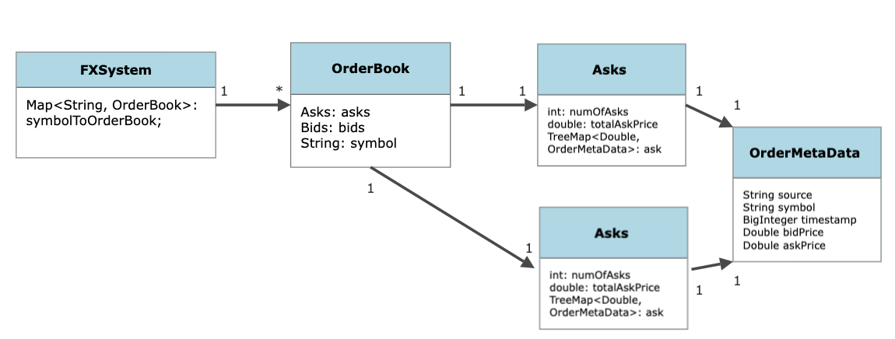

# Spark Systems OA

This readme contains my thought process and planning notes while attempting this assignment. 

## Description

1. There are multiple symbols, or for this case FX trading pairs, The Majors are the most traded
pairs of FX, EURUSD, USDJPY, GPD,USD, etc
   

2. For each of these symbols, there is a bid, ask price from multiple exchanges, we need to store the bids and asks.
Similar to an Orderbook (OB). Basically each symbol has its own OB. 
   
Use a hashmap to map symbol -> OB.
OB must contain 2 sorted maps, also called Treemaps. 

Maps must always contain a key, value pair. Since keys are sorted, we use price as the key, and values can contain the other
metadata, such as timestamp, source. 

This provides us an easy way to obtain the highest BID and lowest ASK, since its inherently sorted.

Here is an example of a high level representation of my design:



## Design Considerations (Pros & Cons)

### What to use as Key?

One drawback of using price as the key is that different exchanges/sources may have the same price
causing new the value to be overwritten. I thought this was alright since the focus is getting the highest bid and
lowest ask price, so overwriting the source and timestamp should be alright. If we assume that the timestamp is increasing, 
it is better to have a price reflect a 'more up to date ticker'. 

We could possibly store the timestamp as the key, but if 2 sources has the same timestamp, the 'correct' price may be overwritten.
Since the price is of concern here, I did not choose this method. 

### Parsing Inputs
1. Scanner vs BufferedReader <br>
Since we are dealing with low latency systems, it is important to prioirtize speed whenenver possible. BufferedReader is almost
   always faster than Scanner due to Scanner's heavy usage of REGEX which adds up and affects performance. 
   


2. String split vs StringTokenizer
While StringTokenizer is faster than string.split, the latter allows us to support regex and returns us an array which 
   fits nicely into what we want. For this assignment, I have stick to using string split but if there is more time to 
   improve the speed, it will probably be better to use a FastParser library. (Possible future improvement)

   
### Timestamp input: 
Most of the input parameters are straight forward, for timestamp it is in this format:

```
2023 05 16 09 31 24 345 = 
2023 Year
05 Month
16 Day
09 Hour
31 Min 
345 miliseconds
```

We can take the absolute difference between queryTime and ticker time to find out if it satisfies the input query. 

Since we do not have to parse it to a localDateTime or other library, we will avoid doing so as wrapping it in additional classes
and unwrapping it will add loads of latency. 

### When do we halt the system? 
1. When we are unable to open the file to read inputs, we should throw an error and terminate the program


2. But when there is a malformed line, ignore it. We should not let that malformed line terminate our program. Perhaps symbol or
timestamp or price is in the wrong format / failed to parse / missing, we will just ignore that line and proceed with handling the next lines. 

## Answering the main Input query:
Query input: 
1. symbol
2. age

Take note age is in milliseconds, meaning how many miliseconds from currTime to ticker's timestamp is considered valid.

I have 2 functions answering this query:

Firstly:

This only gives the best bid and ask price, either 0 or 1 of asks or bids are returned. 
```
FXSystem.queryBestBidAsk(String symbol, BigInteger age)
```
or
```
FXSystem.queryBestBidAsk(String symbol)
```
Overloaded function: if there is no age passed in, then it will return the best since the first order entry. 

If age is passed in as > 0, I will return the best bid and ask among *all* inputs
that satisfies this criteria

`(currTime.subtract(timestamp)).abs().compareTo(age) <= 0`

Sample outputs:
```
Bid Ask Spread for symbol: EURUSD

Lowest ASK = Source: citi, Timestamp: 20230516093124342, Ask Price: 1.309000 
----------------------------------------- 
Highest BID = Source: citi, Timestamp: 20230516093124342, Bid Price: 1.301000 
```

or
```
Bid Ask Spread for symbol: EURUSD

No ASK found within timeframe 
----------------------------------------- 
No BID found within timeframe 
```

or
```
Symbol: SGDMYR has no ASKS or BIDS associated with it.
```

<br>
<br>

Secondly:

This prints the entire orderbook in order

```
FxSystem.printEntireOrderBook("EURUSD")
```

or 
```
FxSystem.printEntireOrderBook("EURUSD", new BigInteger("100))
```


Sample outputs
```
Symbol: EURUSD entire Orderbook. 
------------------------------------
Source: reuters, Timestamp: 20230826093124345, AskPrice: 1.412000
Source: citi, Timestamp: 20230826093124345, AskPrice: 1.409000
Source: reuters, Timestamp: 20230516093124345, AskPrice: 1.312000
Source: citi, Timestamp: 20230516093124342, AskPrice: 1.309000

-----------BID ASK SPREAD---------------

Source: citi, Timestamp: 20230826093124345, BidPrice: 1.403000
Source: reuters, Timestamp: 20230826093124345, BidPrice: 1.402000
Source: citi, Timestamp: 20230516093124342, BidPrice: 1.301000
Source: reuters, Timestamp: 20230516093124345, BidPrice: 1.300000
```
Take note it is ordered from highest ask to lowest ask, and highest bid to lowest bid. 

## Project build files
1. `git clone https://github.com/WillySeahh/sparkSystemsOA.git`
2. Open project using IntellJ
3. Install the necessary dependencies such as Junit, jupiter
   

## Additional Enhancements

Let us try to see how we can enhancement to accommodate the additional filters:

1. Filter prices for input symbol
```
This should be handled already since each symbol contains its own orderbook and via the orderbook we have asks and bids.
Their key is the price, so we are able to get the keySet() and perform filtering on it. 
They are already sorted so a binary search may even be possible. 
```

2. Filter outliers that are more than x% off the average
```
For each symbol they should have a OB, OB has bid and asks. 
For each of the bid, ask, we can store the number of bids/asks, and the cumulative total price.
From then we can get the average. 
```

3. Filter prices according to time
```
This can be handled by creating another map that handles this, we should not pollute the original
design to achieve this purpose as this is probably for viewing purposes / not on hot path / critical path.
```

4. Filter according to sources
```
This can be handled by creating another map that handles this, we should not pollute the original
design to achieve this purpose as this is probably for viewing purposes / not on hot path / critical path.
```

5. Potential for arbitrage
```
When the best ask is lower than best bid, we could take advantage of arbitrage and profit the difference. 
Could send an alert to inform the trader. 
```

